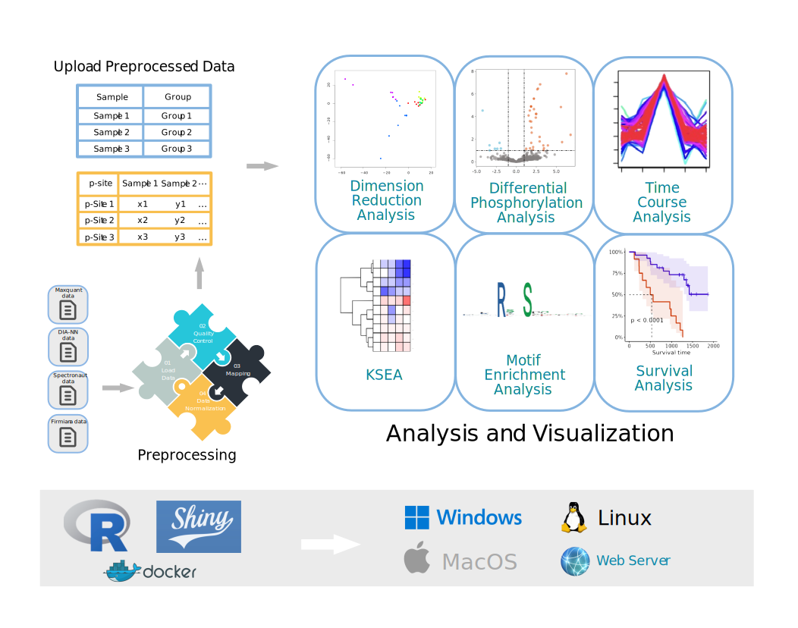
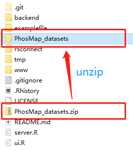

# PhosMap
A Webserver for Comprehensive Analysis of Quantitative Phosphoproteomics


## Brief Description
PhosMap is a user-friendly webserver that enables users to accomplish one-stop phosphoproteomics data analysis, including data preprocessing and six analysis modules (dimension reduction analysis, differential expression analysis, time course analysis, kinase activity prediction, phosphorylation motif enrichment analysis and survival analysis).The online version can be linked from here: https://bio-inf.shinyapps.io/phosmap/.

## How to install
There are two different ways to launch PhosMap:
### 1. Docker-based installation
We provide a docker image with PhosMap: https://hub.docker.com/r/liuzandh/phosmap

Pull the docker image of PhosMap:
```linux
docker pull liuzandh/phosmap:1.0.0
```
Create a docker container containing PhosMap:

```linux
docker run  -p HostPort:3838 liuzandh/phosmap:1.0.0
```
Then, you can enter PhosMap by visiting HostIP:HostPort.

For example: HostPort could be set to 8083. This parameter can be changed according to user needs. 
such as,
```linux
docker run -p 8083:3838 liuzandh/phosmap:1.0.0
```
Next, open 127.0.0.1:8083 in the local browser or remotely access ip:8083 (you should ensure that the machine can be accessed remotely).

### 2. R-based installation
This tool is developed with R, so if you want to run it locally, you may do some preparatory work:
- [1] **Install R.** You can download R from here: https://www.r-project.org/.
- [2] **Install RStudio.** You can download RStudio from here: https://www.rstudio.com/.
- [3] **Download the source code from github.**
- [4] **Download the necessary data.** Please download "PhosMap_datasets.zip" from module "Download" on https://bio-inf.shinyapps.io/phosmap/. Then unzip this file to phosmap folder like this pic.
  
- [5] **Check packages.** After installing R and RStudio, you should check whether you have installed these packages ("shiny","shinyjs","shinyBS","shinyWidgets","ggplot2","ggrepel","plotly","colourpicker","ggseqlogo","pheatmap","survminer","survival","zip","stringr","readr","dplyr","DT","png","svglite","ggplotify","bslib","ksea","rmotifx","PhosMap","qpdf","rrcovNA","e1071","pcaMethods","impute"). 
  You can run the codes below to install them:
  ```linux
  if (!require("BiocManager", quietly = TRUE)){install.packages("BiocManager")}

  BiocManager::install(c("pcaMethods", "impute"))

  install.packages(c("shiny","shinyjs","shinyBS","shinyWidgets","ggplot2","ggrepel","plotly", "colourpicker","ggseqlogo","pheatmap","survminer","survival","zip","stringr","dplyr","DT","png", "svglite","ggplotify","bslib","qpdf", "rrcovNA", "e1071"))

  install.packages('devtools')
  require(devtools)

  install_github('evocellnet/ksea')
  install_github('omarwagih/rmotifx')
  install_github('ecnuzdd/PhosMap')
  ```
- [6] **click "Run App".** View the file ui.R, then just click button "Run App", Phosmap will start.

## Detail of R package "PhosMap"
https://github.com/ecnuzdd/PhosMap

## Friendly suggestion
1. Open PhosMap with Chrome.
2. The minimum operating system specifications are: RAM 8GB, Hard drive 100 GB.

## Reporting issues
You could push an issue on this github if you have any problems.
